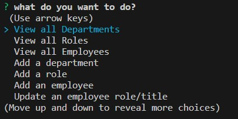
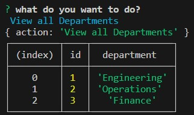
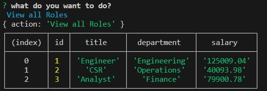
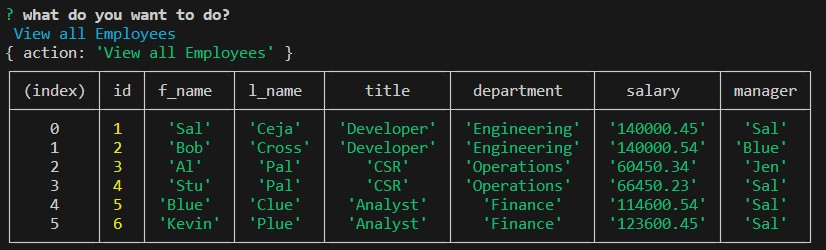

# My Employee Tracker 3000

## Description

- The Employee Tracker 3000 was created to gain practical experience in creating a 'Content Management System' that will allow users to easily interact with the information stored in the database. The packages we will be using are Node.js, Inquirer, and MySQL packages. We will be using MySQL/Sequelize to create, read, update, and delete elements in the tables that we have created in the database. We chose Inquirer because it uses JavaScript instead of SQL syntax to communicate with the database. The outcome is a CLI that users will interact with to retrieve data, enabling them to make better business decisions.

## Installation

- To install this project and make it a part of your repositories, all you have to do is clone our provided repository and install the required packages. For this application, we used Inquirer, MySQL2, and Nodemon. The last one is not necessary, but it helps with the development process because it prevents you from quitting and restarting the app.

## Usage

- The first thing you have to do when you start the application is to log in to your MySQL using the command 'mysql -u root -p'. Next, you run the 'SOURCE db/schema.sql' command to load your schema. Then, you run 'SOURCE db/seed.sql' to add data to your tables.

- The way you use this application is by running 'node index.js'. The CLI will then prompt you with some business-related questions. For example, the first question asks, 'What do you want to do?' and provides you with a list of choices to choose from. Among these choices are queries that correspond to how the data will be returned or entered. For instance, choice 2, 'View all Roles,' will display a table of all the roles/titles that exist in the 'business_db.' The other choices include queries where you provide information. For instance, 'Add a Department' allows you to add a new department to the 'departments' table. After you've gone through all the questions, you'll have a better understanding of your business operations.

# Images

;
;
;
;

## Credits

- GitHub url: https://github.com/Sal1316/my-employee-tracker-3000

- Video walkthrough link: https://drive.google.com/file/d/1gcqs9qXyCJw3O-VxuzYg7T-dDynaMXzD/view
